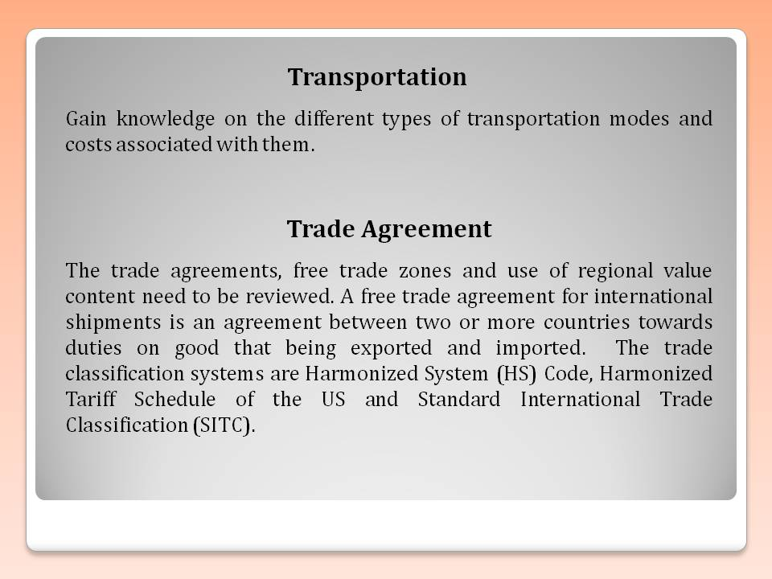
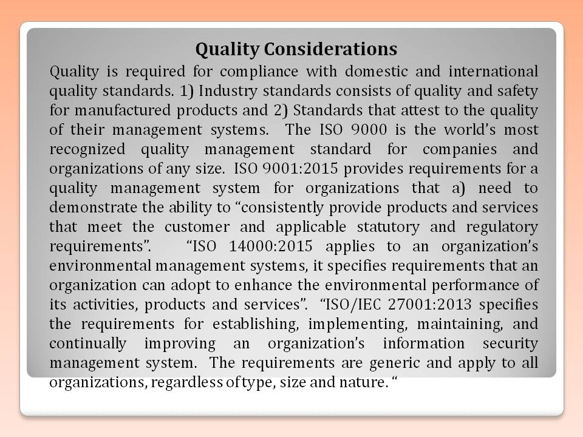
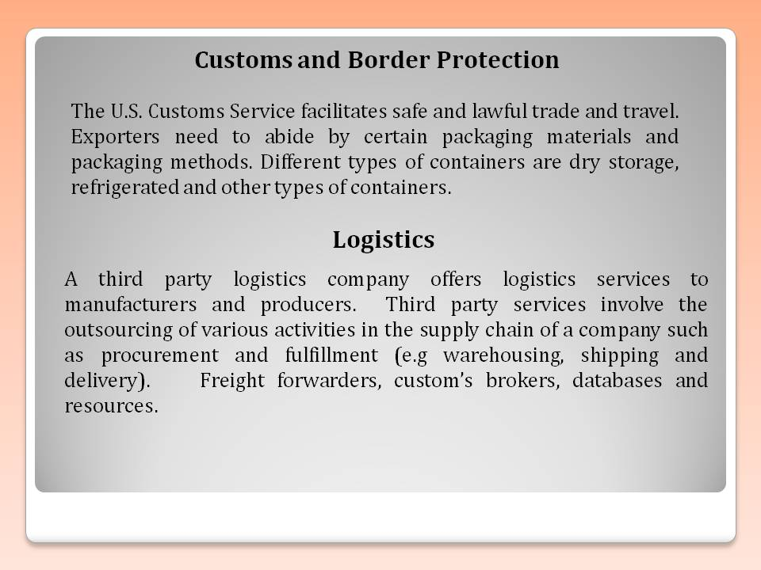
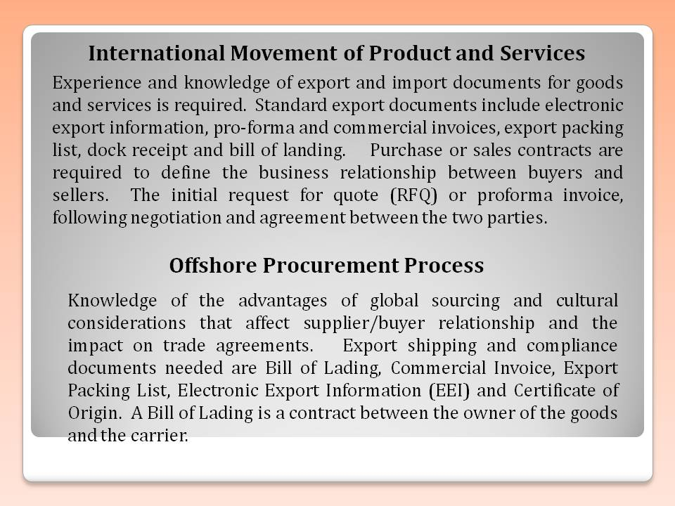
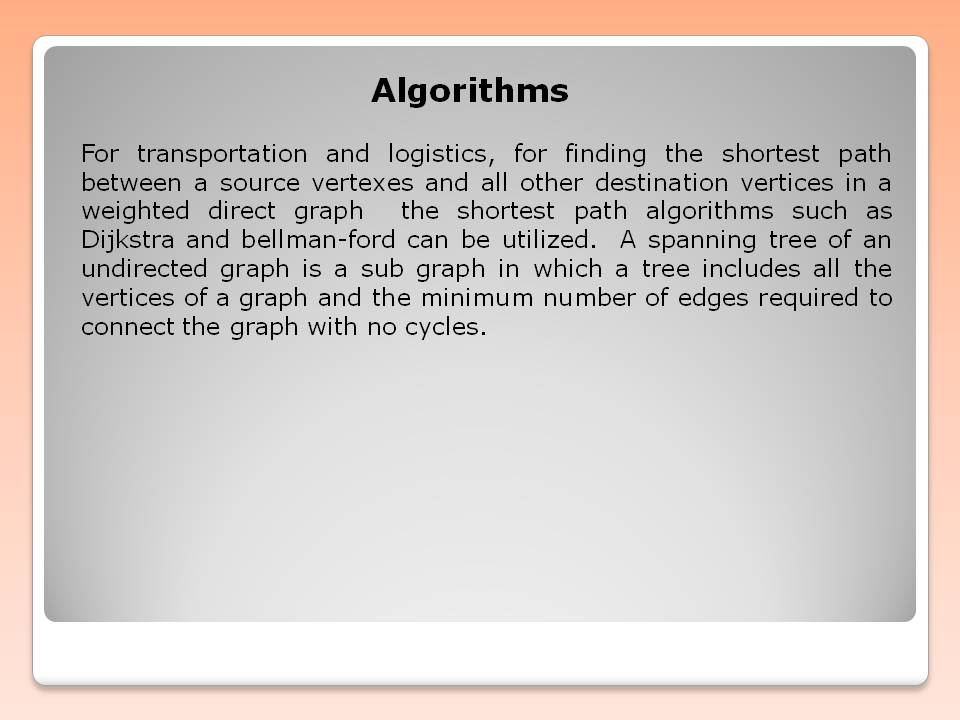

# Global Supply Chain Strategy, Sourcing and Procurement

This repository provides an custom academic individual project on a digital transformation strategy in supply chain 
domain. Confidential information is not displayed.  Reference https://globaledge.msu.edu/ and https://nasbite.org/

## Supply Chain

## Supply Chain

## Supply Chain

## Supply Chain

## Supply Chain

## Ethics and Excellence 

## US Copyright Certificate

Additional details reference: https://github.com/alpaddesai/CodingCombinatorialOptimization, https://github.com/alpaddesai/OperationsResearch and  https://github.com/alpaddesai/Algorithms.
